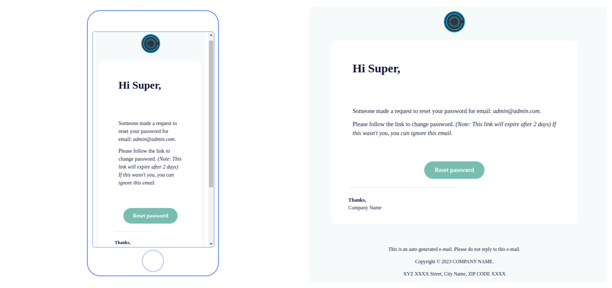

# Email template

Django standard boiler plate for email template.

## How to run?

- Build docker image with `docker build -t boilerplate-email .`
- Run container with `docker-compose up`

Sample template image

## Copyright

Copyright (C) 2022 [Outcode Software](https://www.outcodesoftware.com/).
